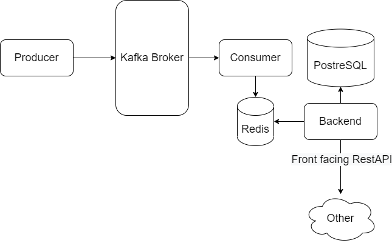

# AlfabetBEExercise
AlfaBet Backend Exercise


## Kafka Server


1. start zookeeper:
   ```.\bin\windows\zookeeper-server-start.bat .\config\zookeeper.properties```     
2. Start server: ```.\bin\windows\kafka-server-start.bat .\config\server.properties```    


## Installation
1. Deploy Kafka
make sure to set the environment variables related:     
```
KAFKA_BROKER=
TOPIC=
GROUP_ID=
```    
2. Deploy PostgreSQL Database   
make sure to set the environment variables related:     
```
POSTGRES_URL=
```    
3. Deploy Redis
make sure to set the environment variables related:     
```
REDIS_URL=
REDIS_PORT=
```    


## PostgreSQL Database

### Products Table

Columns | product_id | product_name | cost 
--- |------------|--------------|------
Example 1| 1          | productA     | 290   
Example 2| 2          | productB     | 210   
Example 3 | 3          | productA     | 190   

### Users Table
Columns | product_id | user_name  | email
--- |------------|------------|------------
Example 1| 1          | Roy Arditi | arditiroy@gmail.com
Example 2| 2          | David S    | 
Example 3 | 3          | Noa R    |  

## APIS (RestAPI)

Description                         | HTTP Method | endpoint                  | params                                |
------------------------------------|-------------|---------------------------|---------------------------------------|
get all users                       | GET         | /api/users                |                                       | 
get single user                     | GET         | /api/users{user_id}       |                                       |
get all products                    | GET         | /api/product              |                                       |  
get single product                  | GET         | /api/product/{product_id} |                                       |  
get metrics                         | GET         | /api/metrics              |                                       |  
get single metric value             | POST        | /api/metrics              | ```{"name": "...", "params": {...}``` |   
register a client to the web socket api allowing it to recive new events whenevert they happen in real time (So the UI could update accordingly)             | websocket   | /ws                       |                                       |   


## Project Structure

```
├───Backend
│   ├───src
│   │   ├───analytics_manager
│   │   ├───consumer_data_managers
│   │   ├───persistant_db
│   │   ├───routes
│   │   ├───utils
├───Producer
│   ├───src
└────────────
```

### Producer
This folder ```Producer/src``` contains a ```main.py``` file.
Execute this file inorder to start producing events to Kafka

### Consumer
This folder ```Backend/src/consumer_data_managers``` contains a file named: ```consumer_manager.py```.
Execute this file inorder to start consuming files from Kafka.

### Mocker
I did not have any Kafka available. Therefore, I created a mocker that could generate data
straight into my ```Redis``` allowing me to proceed with the rest of the requirements.

Execute the file ```Backend/src/consumer_data_managers/mocker.py``` 
inorder to start filling ```Redis``` with data

### Database (Postgres)

The folder ```Backend/src/persistant_db``` contain files for interacting with our database.
As mentioned before, make sure to set the environment variables related:     
```
POSTGRES_URL=
```    

### Analytics
the folder ```Backend/src/analytics_manager``` contains the files which provides metrics calculations.
The metrics are:   
* **user_activities:** Calculating the user activities across any product ever interacted with
* **products_popularity:** Provides Calculation for overall counted interactions with the product (buy/view/... each counted as a single interaction)
* **event_frequencies:** Generally, how many times buy/view/... interaction happened


### APIs
The folder ```Backend/src/routes``` contains files that implement all routes described above
In order for you to execute the backend with all the API's available
you'll need to use ```uvicorn```.
Please go to the root folder and execute the following command localy:
```
uvicorn main:app --reload
```

### Overall Architecture


### Additional steps

Additional steps fo further improvements.
1. Remove the consumer class from the ```Backend``` folder.    
In order for that to happen converting the ```RedisManager``` class and its sole dependencies to a library.
2. 

